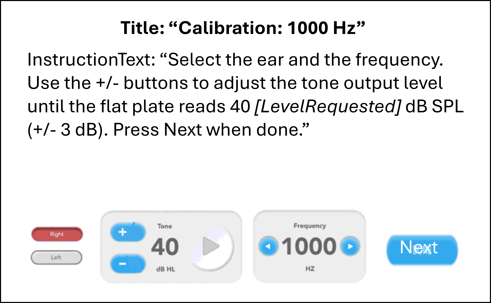
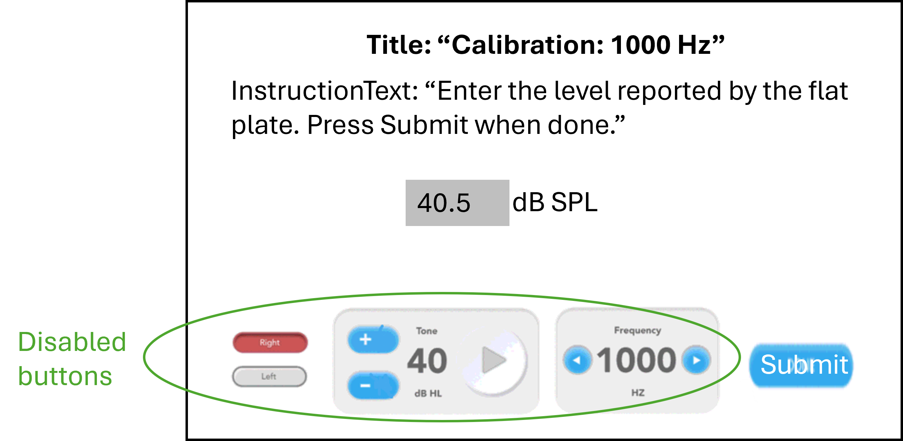
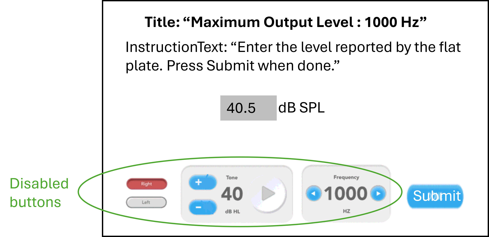

Calibration
=================

This test is to calibrate a speaker.

Revision Table
--------------

.. list-table::
   :widths: 12 18 10 60
   :header-rows: 1

   * - No
     - Date
     - Initials
     - Note
   * - 1
     - 25 Sept 2024
     - VAL
     - Initial commit for a calibration exam. 

References
----------

Related internal documents
^^^^^^^^^^^^^^^^^^^^^^^^^^

This software specification relates to the `firmware specification <https://code.crearecomputing.com/hearingproducts/open-hearing-group/open-hearing-firmware/-/blob/main/Specifications/calibration.rst?ref_type=heads>`_.

Algorithm
--------------

See `firmware specification <https://code.crearecomputing.com/hearingproducts/open-hearing-group/open-hearing-firmware/-/blob/main/Specifications/calibration.rst?ref_type=heads>`_.

Implementation
--------------

GUI
^^^^

The GUI should look like the image below with the following features.

* There should be a frequency panel that displays the current frequency. The frequency panel has left and right buttons to adjust frequency. The buttons should continuously scroll, meaning pressing the right arrow from the highest frequency will bring you back to the lowest frequency. Likewise, pressing the left arrow from the lowest frequency will bring you back to the highest frequency.  The test frequency should not auto-proceed.
* There should be a toggle button to change the test ear.  When the test ear is "Left", the play tone button should be colored blue and the play noise button should be colored red (as in the image below).  When the test ear is "Right", the play tone and play noise button colors should switch.
* There should be a tone presentation panel, that displays the current set level, has a play button, and has buttons for adjusting the tone level up and down. The play button is red with a play icon when a tone is not playing. It is green with a stop symbol when it is playing.
* There should be a textbox to enter the flat plate measured level and a submit button to send the level to the Tympan. 
* There should be a next button to enter `WriteCalibration` = true, where the calibration sequence for a single ear and frequency combination is complete and that the calibration factor or maximum output level can be recorded.

   **Figure 1.** *GUI for the calibration exam. Screen 1*

   **Figure 2.** *GUI for the calibration exam. Screen 2*

   **Figure 3.** *GUI for the calibration exam. Screen 3*

Software Testing Procedures
---------------------------

Algorithm
^^^^^^^^^^^

.. list-table::
   :widths: 30, 30, 30, 6
   :header-rows: 1

   * - Requirement
     - Test Case
     - Acceptance
     - Verified
   * - The exam presents tones with a specified starting frequency, level, and output channel.
     - Start a calibration exam by playing a tone.
     - Verify that the emitted tone is the correct level, frequency and output channel.
     - 
   * - The user can increase the signal level.
     - Adjust the tone level up.
     - Verify that the tones increased by the specified level.
     - 
   * - The user can decrease the signal level.
     - Adjust the tone level down.
     - Verify that the tones decreased by the specified level.
     - 
   * - The user can indicate that the calibration sequence is over.
     - Click the `Next` button.
     - Verify that the ear, tone and frequency buttons are disabled, and that a textbox to enter the measured level is available.
     - 
   * - The user can submit the calibrated output level.
     - Enter the level reported by the flat plate. Click `Submit`.
     - Verify that a textbox to enter the maximum output level is available.
     - 
   * - The user can submit the maximum output level.
     - Enter the level reported by the flat plate. Click `Submit`.
     - Verify that the ear, tone and frequency buttons are enabled, and that you can proceed to the next frequency/ear combination.
     - 
   * - After all the frequencies have a calibration factor and maximum output level recorded, the user can abort the exam.
     - Complete all the frequencies and both ears. Then click the `Finish Calibration` button.
     - Verify that the ear, tone and frequency buttons are disabled, and that clicking the `Finish Calibration` button advances to the next page in the protocol.
     - 

Data
^^^^^^^^^^^^^

.. list-table::
   :widths: 30, 30, 30, 6
   :header-rows: 1

   * - Requirement
     - Test Case
     - Acceptance
     - Verified
   * - The exam must return all fields defined in `firmware specification <https://code.crearecomputing.com/hearingproducts/open-hearing-group/open-hearing-firmware/-/blob/main/Specifications/calibration.rst?ref_type=heads>`_. 
     - Start a calibration exam and complete the exam successfully. 
     - Verify the exam returns all result fields defined in `firmware specification <https://code.crearecomputing.com/hearingproducts/open-hearing-group/open-hearing-firmware/-/blob/main/Specifications/calibration.rst?ref_type=heads>`_ with appropriate values.
     - 
   * - The exam must display all `TestCalibrationResults` fields defined  in `firmware specification <https://code.crearecomputing.com/hearingproducts/open-hearing-group/open-hearing-firmware/-/blob/main/Specifications/calibration.rst?ref_type=heads>`_.
     - Start a calibration exam, complete the exam. 
     - Verify that all results are accurately displayed.
     - 
   * - The exam must export all `TestCalibrationResults` fields defined in `firmware specification <https://code.crearecomputing.com/hearingproducts/open-hearing-group/open-hearing-firmware/-/blob/main/Specifications/calibration.rst?ref_type=heads>`_.
     - Submit the exam and export results.
     - Verify that all results are accurately exported.
     - 

GUI
^^^^

.. list-table::
   :widths: 30, 30, 30, 6
   :header-rows: 1

   * - Requirement
     - Test Case
     - Acceptance
     - Verified
   * - The user can continuously scroll through the frequencies. 
     - On the calibration dashboard, scroll through the fequencies using the right and left buttons.
     - Verify that you can access all the frequencies. Pressing the right arrow from the highest frequency will bring you back to the lowest frequency. Likewise, pressing the left arrow from the lowest frequency will bring you back to the highest frequency.  The test frequency should not auto-proceed.
     - 
   * - The user can change test ear.
     - On the calibration dashboard, change the test ear.
     - Verify that the tones are played from the requested ear.
     - 
   * - The user can change tone level.
     - On the calibration dashboard, change the tone leven.
     - Verify that the tone level is changed accurately.
     - 
