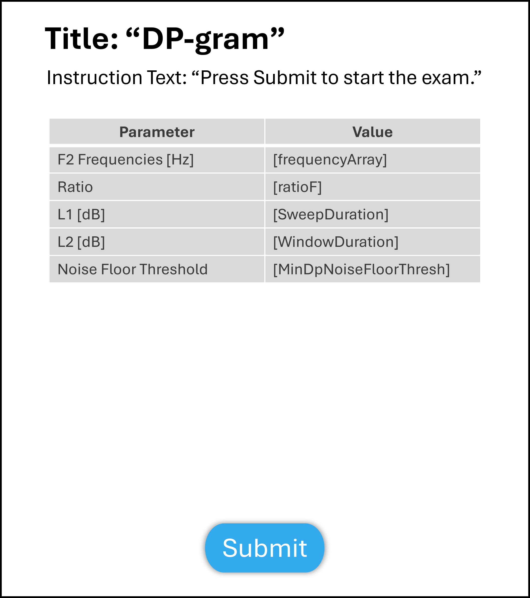
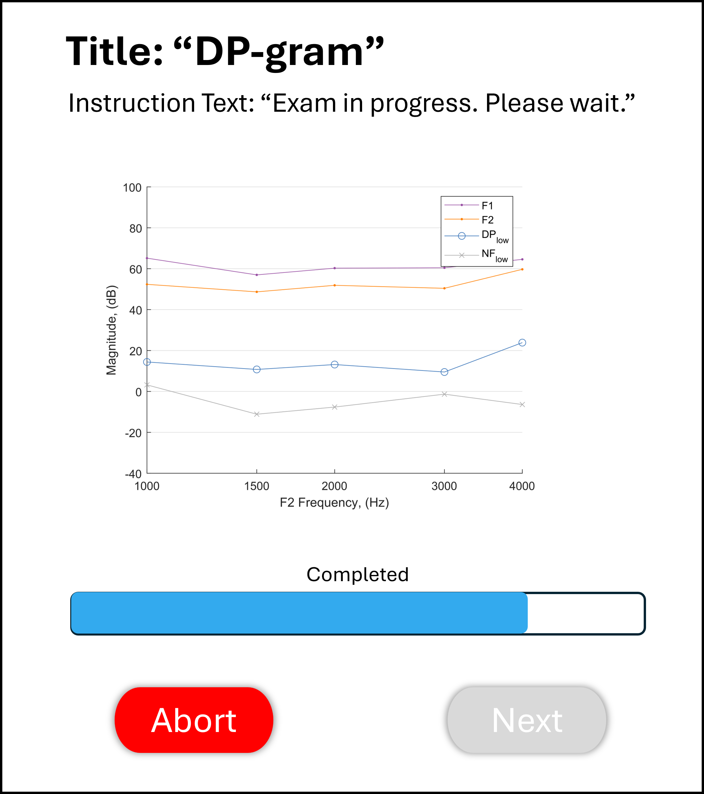
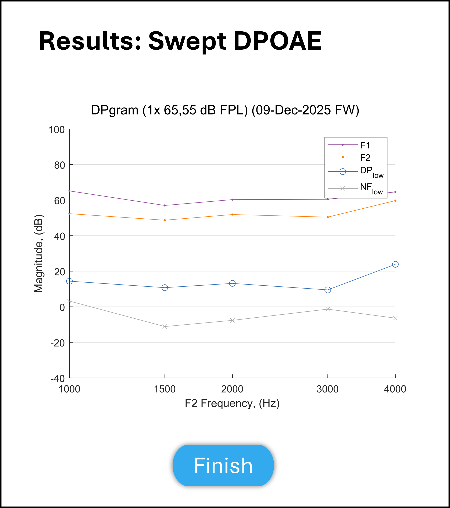

DP-gram
=================================

This test is to perform a DP-gram exam.

Revision Table
--------------

.. list-table::
   :widths: 12 18 10 60
   :header-rows: 1

   * - No
     - Date
     - Initials
     - Note
   * - 1
     - 7 August 2026
     - VAL
     - Initial commit for a DP-gram exam, a software implementation which is a variation of the Swept DPOAE exam and runs a Swept DPOAE firmware exam.

References
----------

Related internal documents
^^^^^^^^^^^^^^^^^^^^^^^^^^

This software specification relates to the `firmware specification <https://code.crearecomputing.com/hearingproducts/open-hearing-group/open-hearing-firmware/-/blob/main/Specifications/swept_dpoae.rst?ref_type=heads>`_.

Algorithm
--------------

See `firmware specification <https://code.crearecomputing.com/hearingproducts/open-hearing-group/open-hearing-firmware/-/blob/main/Specifications/swept_dpoae.rst?ref_type=heads>`_. The DP-gram exam runs a series of firmware Swept DPOAE exams, where each step in the series runs a single frequency (same start and end frequency for each step). This exam specifies which frequencies to run.

To calculate the final results, we:

- Extract the response record for each frequency i: 

  - F2_freq[i] = the F2 frequency value (first sample of F2.Frequency)
  - F1[i] = Complex-Average Magnitude (see below) of the F1 record
  - F2[i] = Complex-Average Magnitude of the F2 record
  - DpLow[i] = Complex-Average Magnitude of the DpLow record
  - NoiseFloor[i] = Aggregated Noise Floor (see below) of DpLow.NoiseFloor, with overlap = 0.5

- Complex-Average Magnitude (dB):

  - Convert each (amplitude, phase) pair to a complex pressure value in Pascals, using reference pressure 20 µPa:

    complex_Pa = 20e-6 * 10^(Amplitude/20) * exp(i * Phase)

  - Average the complex values arithmetically (this coherently averages out uncorrelated phase noise, boosting SNR — unlike averaging magnitudes alone).
  - Take the magnitude of the averaged complex value and convert back to dB SPL:

    mag_dB = 20 * log10( |mean(complex_Pa)| / 20e-6 )  

- Aggregated Noise Floor, 50% overlap:

  - Convert each dB value to power (Pa²) via amplitude, then square:

    power_Pa2 = (20e-6 * 10^(dB/20))^2

  - Discard every other sample to keep only independent measurements: keep samples at indices 1, 3, 5, … (i.e., every 2nd sample starting from the first).
  - Let n = number of remaining samples.
  - Compute the mean noise power using n² in the denominator (not n) — this reflects the expected reduction in noise-floor uncertainty from averaging n independent noise estimates (i.e., this estimates the noise floor of the averaged signal, not the noise floor of a single measurement):

    mean_power_Pa2 = sum(power_Pa2) / n^2

  - Convert back to pressure and then dB:

    mean_Pa = sqrt(mean_power_Pa2)
    noise_dB = 20 * log10(mean_Pa / 20e-6)

Implementation
--------------

GUI
^^^^

The GUI should look like the image below with the following features.

* The following parameters should be configurable in the protocol: Frequency array, frequency ratio, L1 and L2, input and output channels, window duration, minimum and maximum number of test averages, the minimum noise floor threshold and the SNR threshold (i.e., early termination conditions), the directory to store the full waveform, whether to output raw measurement, whether to show results, whether to auto submit each sweep.
* The GUI should display the parameters from the protocol in a table similar to the one shown below
* There should be a `Submit` button to initiate the exam. The `Submit` button becomes inactive after initating the exam.
* After initiating the exam, a progress bar appears and the `Submit` button is replaced with an inactive `Next` button (See screen 2 image below).
* While the exam progresses, live results are plotted for the individual frequencies specfied in the `f2` array. The exam progresses automatically through each frequency. The DPOAE value is plotted as a blue circle and the noise value is plotted as a red 'x'. The normative background plotting is displayed as background.
* The `Next` button becomes active after all of the frequencies of the DP-gram exam are completed.

.. list-table::
   :widths: 50, 50
   :header-rows: 1

   * - Parameter
     - Value
   * - Type
     - ['dpGramResponseArea']
   * - Frequency Array [Hz]
     - [f2]
   * - Min Test Averages
     - [minTestAverages]
   * - Max Test Averages
     - [maxTestAverages]
   * - Frequency Ratio
     - [ratio]
   * - Window Duration [s] 
     - [windowDuration]
   * - Output Calibration Type
     - [outputCalibrationType]
   * - Output Channel 1
     - [outputChannel1]
   * - Output Channel 2
     - [outputChannel2]
   * - Input Channel
     * [inputChannel]
   * - Noise Floor Threshold
     - [noiseFloorThreshold]
   * - SNR Threshold
     - [SNRThreshold]
   * - Directory to store full waveform
     - [recordFileFolder]
   * - Whether to output raw measurements
     - [ouputRawMeasurements]
   * - Whether to show results
     - [showResults]
   * - Normative Data Path
     - [normativeDataPath]
   * - Normative Data
     - [normativeData]

   **Figure 1.** *GUI for the DP-gram exam prior to submission. Screen 1a*

   **Figure 2.** *GUI for the DP-gram exam while the exam is in progress. Screen 1b*

Results-View
^^^^^^^^^^^^^

The GUI should display the results of the DP-gram exam:

* Results are plotted in a manner similar to the plot shown below.
* Below the plot, a table similar to the one shown below should summarize the results saved for the DP-gram exam.

   **Figure 3.** *GUI for the DP-gram Results screen. Results Screen*

Software Testing Procedures
---------------------------

Algorithm
^^^^^^^^^^^

.. list-table::
   :widths: 30, 30, 30, 6
   :header-rows: 1

   * - Requirement
     - Test Case
     - Acceptance
     - Verified
   * - The exam presents chirps with an array of frequencies, frequency ratio, output levels for each frequency, sweep duration, and window duration.
     - Initiate a DP-gram exam using the Submit button.
     - Verify that the emitted chirp is the correct frequency for each step of the sequence, frequency ratio, output levels for each frequency, sweep duration, and window duration.
     - 
   * - The exam accurately computes F1, F2, DpLow, and Noise Floor from the raw firmware response records, using the Complex-Average Magnitude and Aggregated Noise Floor algorithms described above.
     - Set `ouputRawMeasurements` to true and complete a DP-gram exam normally. For one frequency step, take the raw (amplitude, phase) samples recorded for the F1, F2, and DpLow records, and the raw DpLow.NoiseFloor samples, and calculate the expected F1, F2, DpLow, and Noise Floor values using the Complex-Average Magnitude and Aggregated Noise Floor formulas (use `\\olympus\projects\1010564-OPEN-HEARING\Technical Work\Testing\Data\2026-08-11-DPGram-NoiseFloor-AurenSN006\Analysis\test4_plot_dpgram_results.m`).
     - Verify that the F1, F2, DpLow, and Noise Floor values displayed/exported by the app for that frequency step match the hand-calculated values (within floating-point tolerance).
     -
   * - The exam presents a number of chirps greater than or equal to the Minimum Number of Sweeps and less than or equal to the Maximum Number of Sweeps.
     - Initiate a DP-gram exam using the Submit button. Intentionally prevent the exam from meeting the threshold criterion. 
     - Verify that the exam plays at least the Minimum Number of Sweeps and no more than the Maximum Number of Sweeps, then concludes.
     - 
   * - The exam can be aborted.
     - Initiate an exam normally. Once the exam is active, click `Abort`.
     - Verify that the exam aborts successfully and proceeds to the results-view.
     - 
   * - Live results are plotted while the exam progresses.
     - Initiate and complete an exam normally.
     - Verify that DPOAE and noise values are plotted for the frequencies specified while the exam progresses.
     - 
   * - The exam results are displayed.
     - Complete an exam normally. Then click the `Finish` button. Proceed to the results-view page.
     - Verify that the DPOAE, noise floor, F1 and F2 are plotted in dB SPL as a function of F2. Verify that DpLow, DpHigh, F1, and F2 are displayed in table format.
     - 

Data
^^^^^^^^^^^^^

.. list-table::
   :widths: 30, 30, 30, 6
   :header-rows: 1

   * - Requirement
     - Test Case
     - Acceptance
     - Verified
   * - The exam must return all fields defined in `firmware specification <https://code.crearecomputing.com/hearingproducts/open-hearing-group/open-hearing-firmware/-/blob/main/Specifications/swept_dpoae.rst?ref_type=heads>`_. 
     - Start a DP-gram exam and complete the exam successfully. 
     - Verify the exam returns all result fields defined in `firmware specification <https://code.crearecomputing.com/hearingproducts/open-hearing-group/open-hearing-firmware/-/blob/main/Specifications/swept_dpoae.rst?ref_type=heads>`_ with appropriate values.
     - 
   * - The exam must display all `SweptDpoaeResults` fields defined  in `firmware specification <https://code.crearecomputing.com/hearingproducts/open-hearing-group/open-hearing-firmware/-/blob/main/Specifications/swept_dpoae.rst?ref_type=heads>`_.
     - Start a DP-gram exam, complete the exam. 
     - Verify that all results are accurately displayed both during and after the exam.
     - 
   * - The exam must export all `SweptDpoaeResults` fields defined in `firmware specification <https://code.crearecomputing.com/hearingproducts/open-hearing-group/open-hearing-firmware/-/blob/main/Specifications/swept_dpoae.rst?ref_type=heads>`_.
     - Submit the exam and export results.
     - Verify that all results are accurately exported.
     - 

GUI
^^^^

.. list-table::
   :widths: 30, 30, 30, 6
   :header-rows: 1

   * - Requirement
     - Test Case
     - Acceptance
     - Verified
   * - The user can initiate the exam specified in the protocol.
     - Load a DP-gram exam protocol. Then, click `Submit`.
     - Verify that the GUI displays the parameters in the exam protocol and that the exam is initiated after `Submit` is pressed.
     - 
   * - The user can abort the exam.
     - During an active exam, press `Abort`.
     - Verify that the exam aborted.
     -
   * - The user can submit results.
     - After a successful exam, press `Submit`.
     - Verify that the exam results were saved and/or exported to the repository, as specified in the protocol.
     - 
