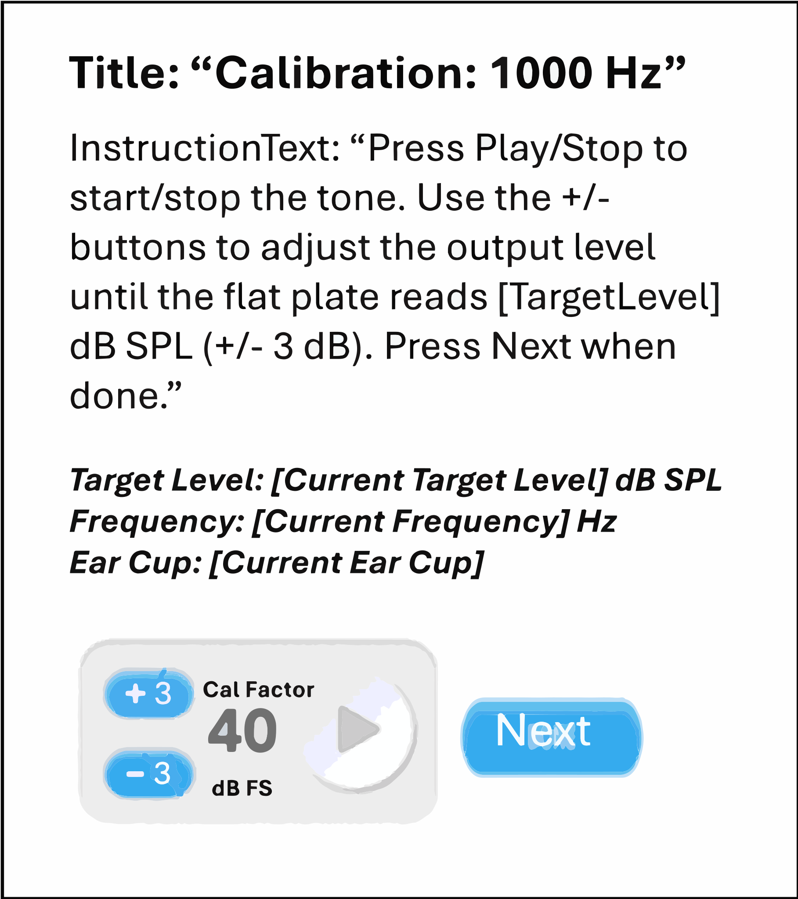
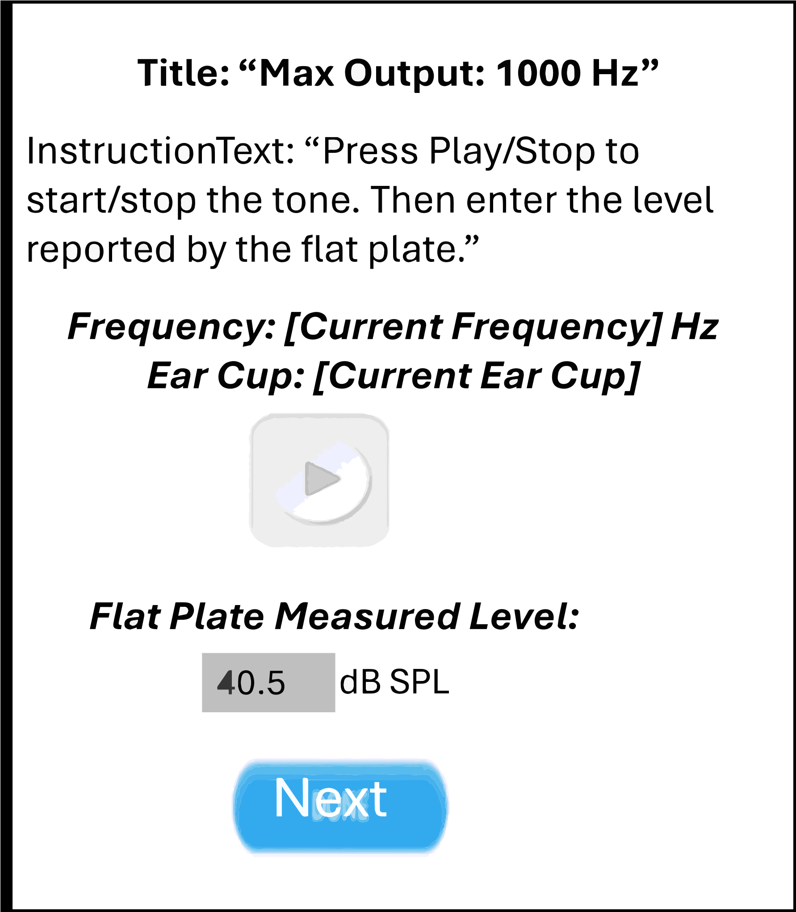

Headphones Narrowband Calibration
=================================

This test is to perform a headphones narrowband calibration.

Revision Table
--------------

.. list-table::
   :widths: 12 18 10 60
   :header-rows: 1

   * - No
     - Date
     - Initials
     - Note
   * - 1
     - 25 Sept 2024
     - VAL
     - Initial commit for a headphones narrowband calibration exam. 

References
----------

Related internal documents
^^^^^^^^^^^^^^^^^^^^^^^^^^

This software specification relates to the `firmware specification <https://code.crearecomputing.com/hearingproducts/open-hearing-group/open-hearing-firmware/-/blob/main/Specifications/headphones_narrowband_calibration.rst?ref_type=heads>`_.

Algorithm
--------------

See `firmware specification <https://code.crearecomputing.com/hearingproducts/open-hearing-group/open-hearing-firmware/-/blob/main/Specifications/headphones_narrowband_calibration.rst?ref_type=heads>`_.

Implementation
--------------

GUI
^^^^

The GUI should look like the image below with the following features.

* The target levels and frequencies should be configurable in the protocol.
* The current frequency, ear cup, and target level should be displayed. The frequencies proceed in the order specified in the protocol.
* There should be a `Cal Factor` panel, that displays the current total adjusted requested level, in dB FS.
* There should be a `Next` button to advance to the next frequency.
* When proceeding from one frequency to the next, the `Cal Factor` should be remembered. (e.g. the initial value for “Cal Factor” at 2 kHz should be equal to the final value for “Cal Factor” at 1 kHz)
* There should be a textbox to enter the flat plate measured level and a submit button to send the level to the Tympan. 
* There should be a `Submit` button to submit the measured flat plate level.

   **Figure 1.** *GUI for the headphones narrowband calibration exam. Screen 1*

.. figure:: headphones-narrowband-calibration-GUI-Screen2.svg
   :align: center

   **Figure 2.** *GUI for the headphones narrowband calibration exam. Screen 2*

   **Figure 3.** *GUI for the headphones narrowband calibration exam. Screen 3*

Results-View
^^^^^^^^^^^^^

The GUI should display the results (calibration factors and maximum output levels) of the headphones narrowband calibration exam, if specified in the protocol. A table as shown below should summarize the results saved on the headphones narrowband calibration exam.

.. list-table::
    :widths: 10, 20, 20
    :header-rows: 1

    * - Frequency (Hz)
      - Calibration Factor (dB FS)
      - Maximum Output Level (dB SPL)
    * - 250 
      -
      -
    * - 500 
      -
      -
    * - 750 
      -
      -
    * - 1000 
      -
      -
    * - 2000 
      -
      -
    * - 3000 
      -
      -
    * - 4000 
      -
      -
    * - 6000 
      -
      -
    * - 8000 
      -
      -
    * - 16000 
      -
      -

Software Testing Procedures
---------------------------

Algorithm
^^^^^^^^^^^

.. list-table::
   :widths: 30, 30, 30, 6
   :header-rows: 1

   * - Requirement
     - Test Case
     - Acceptance
     - Verified
   * - The exam presents tones with a specified starting frequency, level, and output channel.
     - Start a calibration exam by playing a tone.
     - Verify that the emitted tone is the correct level, frequency and output channel.
     - 
   * - The target level and frequencies proceed as specified in the protocol.
     - Complete a headphones narrowband calibration exam.
     - Verify that the tones and frequencies were presented as specified in the protocol.
     - 
   * - After all the frequencies have a calibration factor and maximum output level recorded, the calibration and maximum output levels are recorded.
     - Complete all the frequencies and both ear cups. Then click the `Finish Calibration` button.
     - Verify that the ear cup, tone and frequency buttons are disabled, and that clicking the `Finish Calibration` button advances to the next page in the protocol.
     - 
   * - The calibration factor and maxiumum output levels are displayed.
     - Complete all the frequencies and both ear cups. Then click the `Finish Calibration` button. Proceed to the results-view page.
     - Verify that the calibration factor and maxiumum output levels are displayed for the frequencies specified in the protocol.
     - 

Data
^^^^^^^^^^^^^

.. list-table::
   :widths: 30, 30, 30, 6
   :header-rows: 1

   * - Requirement
     - Test Case
     - Acceptance
     - Verified
   * - The exam must return all fields defined in `firmware specification <https://code.crearecomputing.com/hearingproducts/open-hearing-group/open-hearing-firmware/-/blob/main/Specifications/headphones_narrowband_calibration.rst?ref_type=heads>`_. 
     - Start a calibration exam and complete the exam successfully. 
     - Verify the exam returns all result fields defined in `firmware specification <https://code.crearecomputing.com/hearingproducts/open-hearing-group/open-hearing-firmware/-/blob/main/Specifications/headphones_narrowband_calibration.rst?ref_type=heads>`_ with appropriate values.
     - 
   * - The exam must display all `TestCalibrationResults` fields defined  in `firmware specification <https://code.crearecomputing.com/hearingproducts/open-hearing-group/open-hearing-firmware/-/blob/main/Specifications/headphones_narrowband_calibration.rst?ref_type=heads>`_.
     - Start a calibration exam, complete the exam. 
     - Verify that all results are accurately displayed.
     - 
   * - The exam must export all `TestCalibrationResults` fields defined in `firmware specification <https://code.crearecomputing.com/hearingproducts/open-hearing-group/open-hearing-firmware/-/blob/main/Specifications/headphones_narrowband_calibration.rst?ref_type=heads>`_.
     - Submit the exam and export results.
     - Verify that all results are accurately exported.
     - 

GUI
^^^^

.. list-table::
   :widths: 30, 30, 30, 6
   :header-rows: 1

   * - Requirement
     - Test Case
     - Acceptance
     - Verified
   * - The user can submit the flat plate measured output level.
     - Under the `Calibration` title, enter the level reported by the flat plate. Click `Submit`.
     - Verify that the frequency auto-proceed to the next one.
     - 
   * - The user can submit the maximum output level.
     - Under the `Max Output` title, enter the level reported by the flat plate. Click `Submit`.
     - Verify that the frequency auto-proceed to the next one.
     - 
