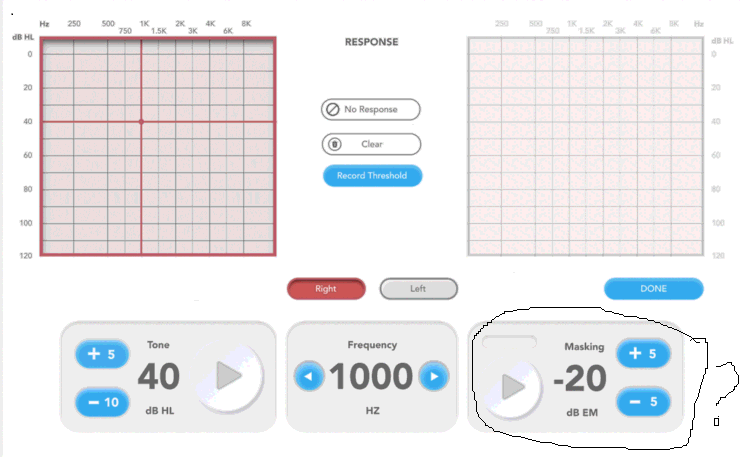
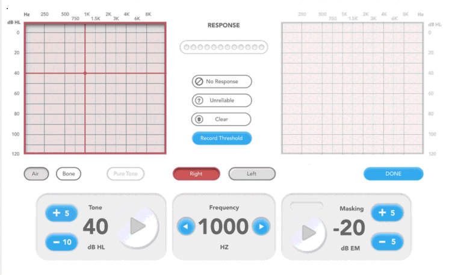

Manual Audiometry
=================

This test is to administer a manual audiometry exam.

Revision Table
--------------

.. list-table::
   :widths: 12 18 10 60
   :header-rows: 1

   * - No
     - Date
     - Initials
     - Note
   * - 1
     - 9 Sept 2024
     - VAL
     - Initial commit for a new manual audiometry exam.  Imported the `CHA DOCS manual audiometry exam <https://cha.crearecomputing.net/cha-docs/CHA/protocols/manual%20audiometry.html>`_` rev 4.2.3. Supports both one- and two-tablet (standard and telehealth) modes, bone conduction, and masking although initially none of these options will be implemented.

References
----------

Related internal documents
^^^^^^^^^^^^^^^^^^^^^^^^^^

This software specification relates to the `firmware specification <https://code.crearecomputing.com/hearingproducts/open-hearing-group/open-hearing-firmware/-/blob/main/Specifications/manual_audiometry.rst?ref_type=heads>`_`.

Literature
^^^^^^^^^^

ANSI S3.6-2018: Specification for audiometers

GUI
^^^^

The GUI should look like the image below with the following features. Features in *italics* are not supported in the Minimum Viable Product.

* There should be a frequency panel that displays the current frequency. The frequency panel has left and right buttons to adjust frequency. The buttons should continuously scroll, meaning pressing the right arrow from the highest frequency will bring you back to the lowest frequency. Likewise, pressing the left arrow from the lowest frequency will bring you back to the highest frequency.  The test frequency should not auto-proceed.
* There should be a toggle button to change the test ear.  When the test ear is "Left", the play tone button should be colored blue and the play noise button should be colored red (as in the image below).  When the test ear is "Right", the play tone and play noise button colors should switch.
* There should be a tone presentation panel, that displays the current set level, has a play button, and has buttons for adjusting the tone level up and down. The play button is red with a play icon when a tone is not playing. It is green with a stop symbol when it is playing.
* *There should be a masking noise panel, that displays the current set level of the masking noise, has a play button, and has buttons for adjusting the noise level up and down.  Once the play noise button has been pressed, the button symbol should change to a "stop" symbol to indicate that the noise stays on until stopped.  If masking is not enabled in the protocol, the masking panel should be greyed out.*
* There should be a "Record" button that saves the current threshold and masking level values.
* There should be an audiogram that builds throughout the exam and indicates the running pure tone average (PTA) for both the left and right ears.  The audiogram should also have an delete option so that a threshold that was recorded on accident may be deleted.  The audiogram must use the correct symbols for the transducer type and test ear. For air-conduction thresholds, remove an unmasked result from the plot when a masked threshold has been recorded for same ear and frequency. For bone-conduction, there can be up to three bone-conduction thresholds marked at a single frequency (i. unmasked, ii. masked-left, iii. masked-right). We'll rely on the allowing audiologists to remove unmasked manual thresholds if they'd like.
* When the tone reaches the maximum output level of the headset, the `No Response` button is enabled. If the admin presses the button, the no response is recorded on the audiogram at the maximum output level using the symbols described in ASHA.
* Behavior at the Maximum Output Level.  If the subject doesn't respond at the Maximum Output Level, use the up adjustment button to increase the level.  The level doesn't increase, but the number display updates (i.e. 90 to (+90) )and the play button greyed out.  From here, use the "No Response" button to record a "No Response" at the Maximum Output Level. 
* Behavior at the Minimum Output Level (-10 dB HL).  If the subject responds at the Minimum Output Level, use the up adjustment button to decrease the level.  The level doesn't decrease, but the number display updates (i.e. -10 to (-90) ) and the play button greyed out.  From here, use the "Record Threshol" button to record a threshold at the Minimum Output Level with a result type `Hearing Possibly Better Than Calibrated Range`. 
* If a tone presentation exceeding 105 dB SPL is requested, a popup warning message should be displayed, stating, "You are about to exceed 105 dB SPL.  By confirming, you acknowledge the risk of presenting potentially hazardous tones to the subject."  The popup message can include a "Do Not Show Again" checkbox.  "Do Not Show Again" = "True" is only active for the given exam.  Navigating away from the exam or submitting the results should reset "Do Not Show Again" to "False".
* *Future.*

  * *There should be a toggle button to be able to change the transducer type between air and bone.  If bone conduction testing is not enabled in the protocol, the bone option should be greyed out.*
  * *There should be a masking noise panel, that displays the current set level of the masking noise, has a play button, and has buttons for adjusting the noise level up and down.  Once the play noise button has been pressed, the button symbol should change to a "stop" symbol to indicate that the noise stays on until stopped.  If masking is not enabled in the protocol, the masking panel should be greyed out.*
  * *The response time should be indicated between the audiograms, with green dots indicating tones and dark grey dot indication when the response was recorded relative to the thones (**PollingOffset**).  *If a response isn't received, no grey dot is shown.*
  * *The **FalsePositive** *should be displayed between the audiograms to indicate that the subject was responding during unexpected times. Each red vertical line indicates one false positive, with a maximum of three (three lines indicate three or more false positives)*.
  * *Keyboard shortcuts should map to the following actions:*

    * *Arrow Up: Increase Tone Level*
    * *Arrow Down: Decrease Tone Level*
    * *Arrow Left: Decrease Frequency*
    * *Arrow Right: Increase Frequency*
    * *Space Bar: Present stimuli*
    * *M: Play/pause masking*
    * *,: Decrease masking level*
    * *.: Increase masking level*
    * *T: Set as threshold*
    * *L: Left*
    * *R: Right*
    * *B: Bone*

   **Figure 1.** *GUI for the MVP*

   **Figure 2.** *GUI for the long term manual audiometry dashboard*

Software Testing Procedures
---------------------------

Algorithm
--------------

.. list-table::
   :widths: 30, 30, 30, 6
   :header-rows: 1

   * - Requirement
     - Test Case
     - Acceptance
     - Verified
   * - The exam presents tones with a specified starting frequency, level, and output channel.
     - Start a Manual Audiometry exam by playing a tone.
     - Verify that the emitted tone is the correct level, frequency and output channel.
     - 
   * - The user can increase the signal level.
     - Adjust the tone level up.
     - Verify that the tones increased by the specified level.
     - 
   * - The user can decrease the signal level.
     - Adjust the tone level down.
     - Verify that the tones decreased by the specified level.
     - 
   * - The user can increase the signal frequency.
     - Adjust the frequency up.
     - Verify that the frequency increased by the specified level.
     - 
   * - The user can decrease the signal frequency.
     - Adjust the frequency down.
     - Verify that the frequency decreased by the specified level.
     - 
   * - The exam cannot play a tone above the maximum output level.
     - Determine the headset's **MaximumOutputLevel** at 3 different frequencies. Attempt to adjust the sound level above the **MaximumOutputLevel** at each frequency.
     - Verify that the headset does not allow a tone to be played above the **MaximumOutputLevel** at each frequency.
     - 
   * - The exam cannot play a tone below the minimum output level.
     - Attempt to adjust the sound level below the **MinimumOutputLevel** (-10 dB HL) at three different frequencies.
     - Verify that the headset does not allow a tone to be played below the **MinimumOutputLevel** at each frequency.
     - 
   * - Narrow-band masking noise of the type specified in Section 6.3 and 7.4 of [AnsiAudiometerSpec2018]_ should be used, where the geometric center frequency coincides with that of the test tone and the bandwidth of the noise is one-third of an octave.
     - Adjust the masker level so that masking noise is presented. Stop the masker and confirm it is stopped.
     - Analyze the waveform and verify that the masking noise has a center frequency that coincides with that of the test tone and the bandwidth of the noise is one-third of an octave.
     - 
   * - The user can change the output channel.
     - Change the output channel.
     - Verify that the tones are emitted from the new output channel.
     - 

Data
---------------

.. list-table::
   :widths: 30, 30, 30, 6
   :header-rows: 1

   * - Requirement
     - Test Case
     - Acceptance
     - Verified
   * - The exam must return all fields defined in `firmware specification <https://code.crearecomputing.com/hearingproducts/open-hearing-group/open-hearing-firmware/-/blob/main/Specifications/manual_audiometry.rst?ref_type=heads>`_`. 
     - Start a Manual Audiometry exam with default input parameters and complete the exam successfully. When appropriate, complete the exam once with a convergent threshold and once without a convergent threshold.
     - Verify the exam returns all result fields defined in `firmware specification <https://code.crearecomputing.com/hearingproducts/open-hearing-group/open-hearing-firmware/-/blob/main/Specifications/manual_audiometry.rst?ref_type=heads>`_` with appropriate values.
     - 
   * - The exam must export all fields defined in TBD to TBD
     - Start a Manual Audiometry exam, complete the exam with all combinations of transducer, ear, masking. Record one threshold at maximum output level, one at minimum output level, one below minimum output level, and one "no response" at maximum output level. Submit and export results.
     - Verify that all results are accurately exported or uploaded.
     - 

GUI
-----------------

.. list-table::
   :widths: 30, 30, 30, 6
   :header-rows: 1

   * - Requirement
     - Test Case
     - Acceptance
     - Verified
   * - The exam must allow the user to control when the tone is played.
     - Start the manual audiometry exam and press the button to play a tone.
     - When the button is pressed, a tone must be played for 3 pulses.
     - 
   * - The exam cannot play a tone above the maximum output level.
     - Attempt to adjust the sound level above the **MaximumOutputLevel** at each frequency.
     - Verify that the GUI does not allow a tone to be played above the **MaximumOutputLevel** at each frequency. The device will notify the user with an error.
     - 
   * - The exam cannot play a tone below the minimum output level (- 10 dB HL). 
     - Attempt to adjust the sound level below the **MinimumOutputLevel** (-10 dB HL) at two different frequencies.
     - Verify that the GUI does not allow a tone to be played below -10 dB HL at each frequency.
     - 
   * - The exam must allow the user to control when the masking noise is played.
     - Navigate to the start page and start the masking noise.  Play a few tones and then stop the masking noise.
     - Verify that when the masking noise button is pressed, the masking noise begins. The noise must stay constant until the button is pressed again to end the masking noise.
     - 
   * - The user can record the threshold/indicate the end condition for each channel/frequency combination.
     - Start a Manual Audiometry exam.  Record the threshold.  Submit the page to end the exam.
     - Confirm that the threshold is recorded on the audiogram and exam results.
     - 
   * - The user can delete a recorded threshold.
     - On the Manual Audiometry dashboard, set the frequency and ear for the threshold to delete. Delete theshold.
     - Confirm that the threshold is deleted on the audiogram as well as the exam results.
     - 
   * - The user can record events where the patient does not respond at the maximum output level.
     - On the Manual Audiometry dashboard, increase level to above the maximum output level.
     - Verify that you can record "no response" and the appropriate symbol per asha appears on the graph and that the exported exam result labels the response as 'Hearing Beyond Calibrated Range'.
     - 
   * - A non-auditory warning indication to the operator is required for all settings above 100 dB hearing level (HL)
     - Adjust the presentation level above 100 dB HL.
     - Verify the following message is presented before any stimuli are ouput: ``You are about to exceed 105 dB SPL.  By confirming, you acknowledge the risk of presenting potentially hazardous tones to the subject.``
     - 
   * - The user can continuously scroll through the frequencies. 
     - On the Manual Audiometry dashboard, scroll through the fequencies using the right and left buttons.
     - Verify that you can access all the frequencies. Pressing the right arrow from the highest frequency will bring you back to the lowest frequency. Likewise, pressing the left arrow from the lowest frequency will bring you back to the highest frequency.  The test frequency should not auto-proceed.
     - 
   * - The user can change test ear.
     - On the Manual Audiometry dashboard, change the test ear.
     - Verify that the tones are played from the requested ear.
     - 
