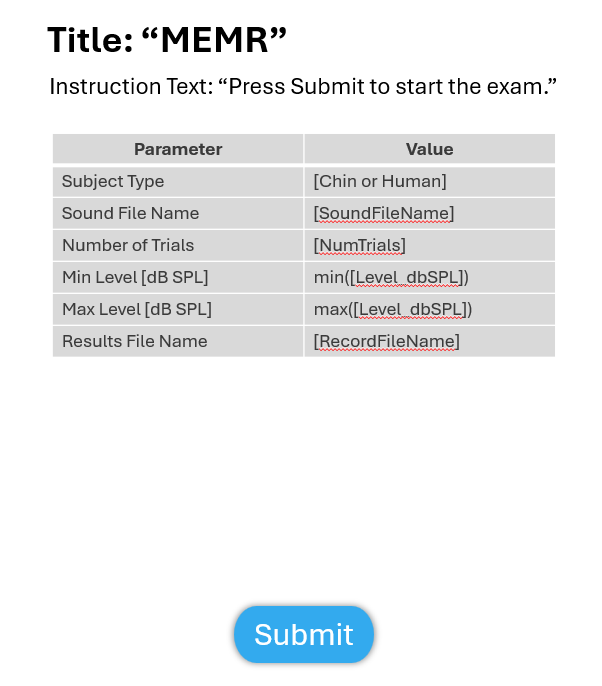
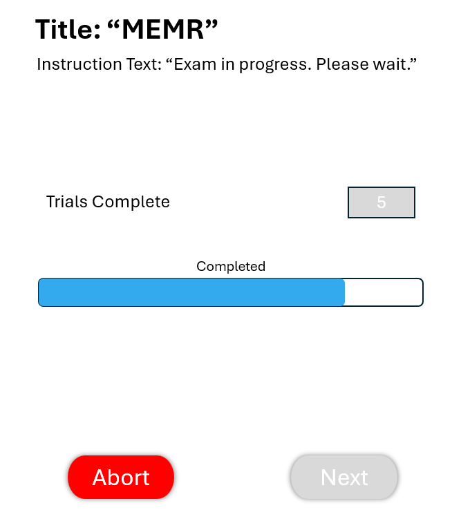
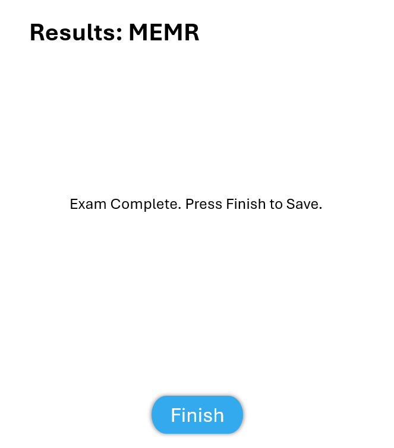

MEMR
=================================

This test is to perform a MEMR (Middle Ear Muscle Reflex).

Revision Table
--------------

.. list-table::
   :widths: 12 18 10 60
   :header-rows: 1

   * - No
     - Date
     - Initials
     - Note
   * - 1
     - 3 July 2025
     - BGraybill
     - Initial commit for a MEMR exam.
   * - 2
     - 28 August 2025
     - VAL
     - MVP updates for a MEMR exam.

References
----------

Related internal documents
^^^^^^^^^^^^^^^^^^^^^^^^^^

This software specification relates to the `firmware specification <https://code.crearecomputing.com/hearingproducts/open-hearing-group/open-hearing-firmware/-/blob/feature/play-record-exam/Specifications/play_record_exam.rst?ref_type=heads>`_.

Background information on this exam: "\\Olympus\Projects\1010564-OPEN-HEARING\Technical Work\Pictures & Video\2025-05-05_MEMR_Diagram\2022-05-27_MEMR Specs.pptx"

Algorithm
--------------

See `firmware specification <https://code.crearecomputing.com/hearingproducts/open-hearing-group/open-hearing-firmware/-/blob/feature/play-record-exam/Specifications/play_record_exam.rst?ref_type=heads>`_.

Implementation
--------------

GUI
^^^^

- The following parameters should be configurable in the protocol

   - Elicitor level change

      - Enum: "Within Block" or "Between Blocks"
      - Within Block: for a chinchilla exam -- the elicitor level changes within a block, but each block presents the same level progression.
      - Between Blocks: for a human exam -- the elicitor level remains the same within a block, but changes for different blocks.
   - Elicitor level array

      - Changes each trial or block and determines # of trials or blocks, depending on the level change parameter
      - If Level Change is “Between Blocks”, then elicitor levels change accross blocks, length of elicitor level array is the # of blocks in the exam.
      - If Level Change is “Within Block”, then elicitor levels change within blocks, length of elicitor level array is the # of trials within the block.
   - Number of repeats at the trial or block level
      
      - If Level Change is “Between Blocks”, then repeats are the # of trials within the block.
      - If Level Change is “Within Block”, then repeats are the # of blocks.
   - Probe stimulus level, remains the same accross all blocks and trials
   - Submission interval: wait period after completing all trials, in msec
   - Probe output channel

      - Sets the probe output channel ( e.g."HPL0" or ["HPL0","HPR0"])
   - Elicitor output channel

      - Sets the elicitor output channel ( e.g."HPL0" or ["HPL0","HPR0"])
      - Note: the MEMR firmware `PlaybackChannel` corresponds to `[ProbeOutputChannel, EllicitorOutputChannel]`

   - Recording Channels (e.g."LEFT:BOARD_MIC" or ["LEFT:BOARD_MIC", "RIGHT:BOARD_MIC"])
   
     - Note: this parameter maps directly to the firmware `RecordChannel`

   - Boolean for using the gain metascalar. If true, read the metadata scalar from the wavefile and record
   - Sound file name. Path of the wavefile to play on the Tympan. This can include a directory such as /MEMR/play.wav.

     - Note: Specify a 2-channel WAV file for playback, with the elicitor on channel-0 and the probe stimulus on channel-1.
     
   - Folder name on the Tympan where the recorded sound files are stored.
   - Record file name. Path of the WAV file to to record. Files are appended with _NNN, e.g., a specification of /MEMR/blk001/rec.wav results in /MEMR/blk001/rec_001.wav,
- The GUI should display the following information in a table like the one below prior to starting the exam (Figure 1): 

.. list-table::
   :widths: 50, 50
   :header-rows: 1

   * - Parameter
     - Value
   * - Level Change
     - [LevelChange]
   * - Subject Type
     - [Human or Chinchilla]
   * - Number of Blocks
     - [NumBlocks]
   * - Number of Trials
     - [NumTrials]
   * - Elicitor Level Array [dBSPL]
     - [Level_dbSPL]
   * - Probe Stimulus Level [dBP]
     - [ProbeStimulusLevel]
   * - Submission Interval [ms] 
     - [SubmissionInterval_ms]
   * - Probe Output Channel 
     - [ProbeOutputChannel]
   * - Elicitor Output Channel
     - [ElicitorOutputChannel]
   * - Gain Scaling
     - [metaDataScalar]
   * - Sound File Folder
     - [SoundFileName]
   * - Results File Folder
     - [RecordFileFolder]
   * - Results File name
     - [RecordFileName]

* There should be a `Submit` button to initiate the exam. The `Submit` button becomes inactive after initating the exam.
* After initiating the exam, a progress bar appears along with a reported numerical value for the number of blocks completed and a progress bar displaying the total (accumulated) number of trials played. The `Submit` button is replaced with an `Abort` button (See Figure 2 below) should early termination of the exam be required.
* If "Abort" is selected, display a message to the user confirming they want to abort this exam. Aborting the exam should save partial results for this page and proceed to the next page in the protocol.
* After the MEMR exam concludes, a Results page is displayed with a message indicating the exam is complete. The displayed `Finish` button saves the results and proceeds to the next page specified in the protocol.

The GUI should look like Figures 1-3 below.

   **Figure 1.** *GUI for the MEMR exam prior to submission. Screen 1*

   **Figure 2.** *GUI for the MEMR exam while the exam is in progress. Screen 2*

Results-View
^^^^^^^^^^^^^

The GUI should display the concluding page after the MEMR exam:

   **Figure 3.** *GUI for the MEMR Results screen. Results Screen*

Software Testing Procedures
---------------------------

Algorithm
^^^^^^^^^^^

.. list-table::
   :widths: 30, 30, 30, 6
   :header-rows: 1

   * - Requirement
     - Test Case
     - Acceptance
     - Verified
   * - The exam presents interspersed probe and elicitor stimuli for the number of repetitions specified in the protocol.
     - Initiate a MEMR exam using the Submit button.
     - Verify that the emitted sound is repeated the correct number of times.
     - 
   * - The elicitor level increases between repetitions for a human subject.
     - Load a MEMR protocol for a human subject.
     - Initiate a MEMR exam using the Submit button.
     - Verify that the elictor level increases between repetitions.
     - 
   * - The elicitor level increases within a single repetition for a chinchilla subject.
     - Load a MEMR protocol for a chinchilla subject.
     - Initiate a MEMR exam using the Submit button.
     - Verify that the elicitor level increases within a single repetition.
     - 
   * - The exam can be aborted.
     - Initiate an exam normally. Once the exam is active, click `Abort`.
     - Verify that the exam aborts successfully and proceeds to the results-view.
     - 
   * - The exam correctly exports the recorded WAV files.
     - Complete an exam normally. Then click the `Finish` button. Proceed to the results-view page.
     - Verify that the recorded result is saved in the specified location and with the name specified in the exam protocol.
     - 

Data
^^^^^^^^^^^^^

.. list-table::
   :widths: 30, 30, 30, 6
   :header-rows: 1

   * - Requirement
     - Test Case
     - Acceptance
     - Verified
   * - The exam must return all fields defined in `firmware specification <https://code.crearecomputing.com/hearingproducts/open-hearing-group/open-hearing-firmware/-/blob/feature/play-record-exam/Specifications/play_record_exam.rst?ref_type=heads>`_. 
     - Start a Swept OAE exam and complete the exam successfully. 
     - Verify the exam returns all result fields defined in `firmware specification <https://code.crearecomputing.com/hearingproducts/open-hearing-group/open-hearing-firmware/-/blob/feature/play-record-exam/Specifications/play_record_exam.rst?ref_type=heads>`_ with appropriate values.
     - 
   * - The exam must export all `MEMRResults` fields defined in `firmware specification <https://code.crearecomputing.com/hearingproducts/open-hearing-group/open-hearing-firmware/-/blob/feature/play-record-exam/Specifications/play_record_exam.rst?ref_type=heads>`_.
     - Submit the exam and export results.
     - Verify that all results are accurately exported.
     - 

GUI
^^^^

.. list-table::
   :widths: 30, 30, 30, 6
   :header-rows: 1

   * - Requirement
     - Test Case
     - Acceptance
     - Verified
   * - The user can initiate the exam specified in the protocol.
     - Load a MEMR exam protocol. Then, click `Submit`.
     - Verify that the GUI displays the parameters in the exam protocol and that the exam is initiated after `Submit` is pressed.
     - 
   * - The interim status of an exam is displayed with a progress bar and numerical value of the completed blocks.
     - Load a MEMR exam protocol. Then, click `Submit`.
     - Verify that the correct number of completed blocks is displayed throughout the exam.
     -
   * - The user can abort the exam.
     - During an active exam, press `Abort`.
     - Verify that the exam aborted.
     -
   * - The user can submit results.
     - After a successful exam, press `Submit`.
     - Verify that the exam results were saved and/or exported to the repository, as specified in the protocol.
     - 
