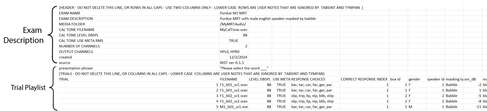

Modified Rhyme Test
=================================

This test is to perform a Modified Rhyme Test (MRT).

Revision Table
--------------

.. list-table::
   :widths: 12 18 10 60
   :header-rows: 1

   * - No
     - Date
     - Initials
     - Note
   * - 1
     - 2 December 2024
     - BGraybill
     - Initial commit for a Modified Rhyme Test exam.

References
----------

Related internal documents
^^^^^^^^^^^^^^^^^^^^^^^^^^

This software specification relates to the `link TBD`_.

Algorithm
--------------

See `link TBD`_.

Implementation
--------------

GUI
^^^^

The GUI should look like the image below with the following features.

* The following parameters should be configurable in the protocol: filename of the CSV/Excel file that specifies wavefiles and exam parameters. The format for this **fixed** and must be matched (see Figure 1 below). Cell entries for "My Notes" are optional. All other entries are required.
* There should be a `Submit` button to initiate the exam. The `Submit` button becomes inactive after initating the exam.
* After initiating the exam, a progress bar appears, an `Abort` appears and the and the `Submit` button is replaced with an inactive `Next` button (see screen 2 image below).
* The `Next` button becomes active after each word presentation. Pressing the `Next` button takes the user to the next word set.
* Correct word selections are communicated to the user with the correct word borderd in green and a "Correct!" text message. (see screen 3a below)
* Incorrect word selections are communicated to the user with the correct word bordered in green, the selected word bordered in red, and a message stating the correct word (see screen 3b below).

.. list-table::
   :widths: 50, 50
   :header-rows: 1

   * - Parameter
     - Value
   * - Exam Definition File
     - [exam_definition.xlsx]
  

   **Figure 1.** *Exam definition format with example entries.*

   **Figure 2.** *GUI for the MRT exam prior to submission. Screen 1*

   **Figure 3.** *GUI for the MRT exam while the exam is in progress. Screen 2*

   **Figure 4.** *GUI for the MRT exam after a correct response. Screen 3a*

   **Figure 5.** *GUI for the MRT exam after an incorrect response. Screen 3b*

Results-View
^^^^^^^^^^^^^

The GUI should display the results of the MRT exam:
* The results consist of a table with columns for SNR level, trials presented (at each SNR level), the number of trials correct, and the percentage of trials correct (raw, unadjusted for guessing)

   **Figure 6.** *GUI for the MRT Results screen. Results Screen*

Software Testing Procedures
---------------------------

Algorithm
^^^^^^^^^^^

.. list-table::
   :widths: 30, 30, 30, 6
   :header-rows: 1

   * - Requirement
     - Test Case
     - Acceptance
     - Verified
   * - The exam presents chirps with a specified starting and ending frequency for F2, frequency ratio, output levels for each frequency, sweep duration, window duration, and sweep type.
     - Initiate a Swept OAE exam using the Submit button.
     - Verify that the emitted chirp is the correct starting and ending frequency for F2, frequency ratio, output levels for each frequency, sweep duration, window duration, and sweep type.
     - 
   * - The exam presents a number of chirps greater than or equal to the Minimum Number of Sweeps and less than or equal to the Maximum Number of Sweeps.
     - Initiate a Swept OAE exam using the Submit button. Intentionally prevent the exam from meeting the threshold criterion. This could be accomplished in many ways including, but not limited to, specifying a very few number of 
     - Verify that the exam plays at least the Minimum Number of Sweeps and no more than the Maximum Number of Sweeps, then concludes.
     - 
   * - If the noise threshold criterion is met, the exam concludes.
     - ???
     - Verify that exam concludes if the noise threshold criterion is met.
     - 
   * - The exam can be aborted.
     - Initiate an exam normally. Once the exam is active, click `Abort`.
     - Verify that the exam aborts successfully and proceeds to the results-view.
     - 
   * - Live results are plotted while the exam progresses.
     - Initiate and complete an exam normally.
     - Verify that DPOAE and noise values are plotted for the frequencies specified while the exam progresses.
     - 
   * - The exam results are displayed.
     - Complete an exam normally. Then click the `Finish` button. Proceed to the results-view page.
     - Verify that the OAE, noise floor, F1 and F2 are plotted in dB SPL as a function of F2. Verify that DpLow, DpHigh, F1, and F2 are displayed in table format.
     - 

Data
^^^^^^^^^^^^^

.. list-table::
   :widths: 30, 30, 30, 6
   :header-rows: 1

   * - Requirement
     - Test Case
     - Acceptance
     - Verified
   * - The exam must return all fields defined in `firmware specification <https://code.crearecomputing.com/hearingproducts/open-hearing-group/open-hearing-firmware/-/blob/main/Specifications/swept_dpoae.rst?ref_type=heads>`_. 
     - Start a Swept OAE exam and complete the exam successfully. 
     - Verify the exam returns all result fields defined in `firmware specification <https://code.crearecomputing.com/hearingproducts/open-hearing-group/open-hearing-firmware/-/blob/main/Specifications/swept_dpoae.rst?ref_type=heads>`_ with appropriate values.
     - 
   * - The exam must display all `SweptDpoaeResults` fields defined  in `firmware specification <https://code.crearecomputing.com/hearingproducts/open-hearing-group/open-hearing-firmware/-/blob/main/Specifications/swept_dpoae.rst?ref_type=heads>`_.
     - Start a Swept OAE exam, complete the exam. 
     - Verify that all results are accurately displayed both during and after the exam.
     - 
   * - The exam must export all `SweptDpoaeResults` fields defined in `firmware specification <https://code.crearecomputing.com/hearingproducts/open-hearing-group/open-hearing-firmware/-/blob/main/Specifications/swept_dpoae.rst?ref_type=heads>`_.
     - Submit the exam and export results.
     - Verify that all results are accurately exported.
     - 

GUI
^^^^

.. list-table::
   :widths: 30, 30, 30, 6
   :header-rows: 1

   * - Requirement
     - Test Case
     - Acceptance
     - Verified
   * - The user can initiate the exam specified in the protocol.
     - Load a Swept OAE exam protocol. Then, click `Submit`.
     - Verify that the GUI displays the parameters in the exam protocol and that the exam is initiated after `Submit` is pressed.
     - 
   * - The user can abort the exam.
     - During an active exam, press `Abort`.
     - Verify that the exam aborted.
     -
   * - The user can submit results.
     - After a successful exam, press `Submit`.
     - Verify that the exam results were saved and/or exported to the repository, as specified in the protocol.
     - 
