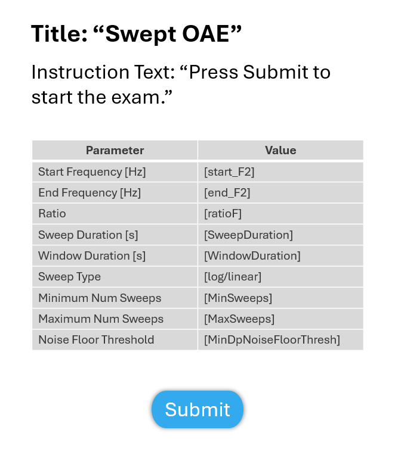

Swept OAE
=================================

This test is to perform a swept OAE.

Revision Table
--------------

.. list-table::
   :widths: 12 18 10 60
   :header-rows: 1

   * - No
     - Date
     - Initials
     - Note
   * - 1
     - 13 November 2024
     - BGraybill
     - Initial commit for a swept OAE exam. 

References
----------

Related internal documents
^^^^^^^^^^^^^^^^^^^^^^^^^^

This software specification relates to the `firmware specification <https://code.crearecomputing.com/hearingproducts/open-hearing-group/open-hearing-firmware/-/blob/main/Specifications/swept_dpoae.rst?ref_type=heads>`_.

Algorithm
--------------

See `firmware specification <https://code.crearecomputing.com/hearingproducts/open-hearing-group/open-hearing-firmware/-/blob/main/Specifications/swept_dpoae.rst?ref_type=heads>`_.

Implementation
--------------

GUI
^^^^

The GUI should look like the image below with the following features.

* The following parameters should be configurable in the protocol: Start frequency of the sweep, end frequency of the sweep, frequency ratio, sweep duration, window duration, sweep type (log or linear), minimum number of sweeps, maximum number of sweeps, and the minimum noise floor threshold (i.e., the termination condition)
* The GUI should display the parameters from the protocol in a table similar to the one shown below
* There should be a `Submit` button to initiate the exam.

.. list-table::
   :widths: 50, 50
   :header-rows: 1

   * - Parameter
     - Value
   * - Start Frequency [Hz]
     - [start_F2]
   * - End Frequency [Hz]
     - [end_F2]
   * - Ratio
     - [ratioF]
   * - Sweep Duration [s]
     - [SweepDuration]
   * - Window Duration [s] 
     - [WindowDuration]
   * - Sweep type
     - [SweepType]
   * - Minimum Number of Sweeps
     - [MinSweeps]
   * - Maximum Number of Sweeps
     - [MaxSweeps]
   * - Noise Floor Threshold
     - [MinDpNoiseFloorThresh]

   **Figure 1.** *GUI for the swept OAE exam. Screen 1*

Results-View
^^^^^^^^^^^^^

The GUI should display the results of the swept OAE exam if specified in the protocol. A table similar to the one shown below should summarize the results saved for the swept OAE exam.

.. list-table::
    :widths: 10, 20, 20
    :header-rows: 1

    * - Result
      - Value
      - Units
    * - Dp Low 
      - 
      - dB SPL
    * - Dp High
      -
      - dB SPL
    * - F1
      -
      - dB SPL
    * - F2
      -
      - dB SPL

Software Testing Procedures
---------------------------

Algorithm
^^^^^^^^^^^

.. list-table::
   :widths: 30, 30, 30, 6
   :header-rows: 1

   * - Requirement
     - Test Case
     - Acceptance
     - Verified
   * - The exam presents tones with a specified starting frequency, level, and output channel.
     - Start a calibration exam by playing a tone.
     - Verify that the emitted tone is the correct level, frequency and output channel.
     - 
   * - The target level and frequencies proceed as specified in the protocol.
     - Complete a swept OAE exam.
     - Verify that the tones and frequencies were presented as specified in the protocol.
     - 
   * - After all the frequencies have a calibration factor and maximum output level recorded, the calibration and maximum output levels are recorded.
     - Complete all the frequencies and both ear cups. Then click the `Finish Calibration` button.
     - Verify that the ear cup, tone and frequency buttons are disabled, and that clicking the `Finish Calibration` button advances to the next page in the protocol.
     - 
   * - The calibration factor and maxiumum output levels are displayed.
     - Complete all the frequencies and both ear cups. Then click the `Finish Calibration` button. Proceed to the results-view page.
     - Verify that the calibration factor and maxiumum output levels are displayed for the frequencies specified in the protocol.
     - 

Data
^^^^^^^^^^^^^

.. list-table::
   :widths: 30, 30, 30, 6
   :header-rows: 1

   * - Requirement
     - Test Case
     - Acceptance
     - Verified
   * - The exam must return all fields defined in `firmware specification <https://code.crearecomputing.com/hearingproducts/open-hearing-group/open-hearing-firmware/-/blob/main/Specifications/headphones_narrowband_calibration.rst?ref_type=heads>`_. 
     - Start a calibration exam and complete the exam successfully. 
     - Verify the exam returns all result fields defined in `firmware specification <https://code.crearecomputing.com/hearingproducts/open-hearing-group/open-hearing-firmware/-/blob/main/Specifications/headphones_narrowband_calibration.rst?ref_type=heads>`_ with appropriate values.
     - 
   * - The exam must display all `TestCalibrationResults` fields defined  in `firmware specification <https://code.crearecomputing.com/hearingproducts/open-hearing-group/open-hearing-firmware/-/blob/main/Specifications/headphones_narrowband_calibration.rst?ref_type=heads>`_.
     - Start a calibration exam, complete the exam. 
     - Verify that all results are accurately displayed.
     - 
   * - The exam must export all `TestCalibrationResults` fields defined in `firmware specification <https://code.crearecomputing.com/hearingproducts/open-hearing-group/open-hearing-firmware/-/blob/main/Specifications/headphones_narrowband_calibration.rst?ref_type=heads>`_.
     - Submit the exam and export results.
     - Verify that all results are accurately exported.
     - 

GUI
^^^^

.. list-table::
   :widths: 30, 30, 30, 6
   :header-rows: 1

   * - Requirement
     - Test Case
     - Acceptance
     - Verified
   * - The user can submit the flat plate measured output level.
     - Under the `Calibration` title, enter the level reported by the flat plate. Click `Submit`.
     - Verify that the frequency auto-proceed to the next one.
     - 
   * - The user can submit the maximum output level.
     - Under the `Max Output` title, enter the level reported by the flat plate. Click `Submit`.
     - Verify that the frequency auto-proceed to the next one.
     - 
