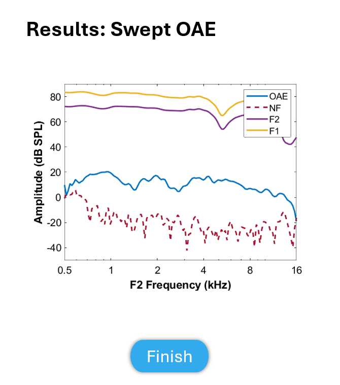

Swept OAE
=================================

This test is to perform a Swept OAE.

Revision Table
--------------

.. list-table::
   :widths: 12 18 10 60
   :header-rows: 1

   * - No
     - Date
     - Initials
     - Note
   * - 1
     - 13 November 2024
     - BGraybill
     - Initial commit for a swept OAE exam.

References
----------

Related internal documents
^^^^^^^^^^^^^^^^^^^^^^^^^^

This software specification relates to the `firmware specification <https://code.crearecomputing.com/hearingproducts/open-hearing-group/open-hearing-firmware/-/blob/main/Specifications/swept_dpoae.rst?ref_type=heads>`_.

Algorithm
--------------

See `firmware specification <https://code.crearecomputing.com/hearingproducts/open-hearing-group/open-hearing-firmware/-/blob/main/Specifications/swept_dpoae.rst?ref_type=heads>`_.

Implementation
--------------

GUI
^^^^

The GUI should look like the image below with the following features.

* The following parameters should be configurable in the protocol: Start frequency of the sweep, end frequency of the sweep, frequency ratio, sweep duration, window duration, sweep type (log or linear), minimum number of sweeps, maximum number of sweeps, and the minimum noise floor threshold (i.e., the termination condition)
* The GUI should display the parameters from the protocol in a table similar to the one shown below
* There should be a `Submit` button to initiate the exam. The `Submit` button becomes inactive after initating the exam.
* After initiating the exam, a progress bar appears and the `Submit` button is replaced with an inactive `Next` button (See screen 2 image below).
* While the exam progresses, live results are plotted for the individual frequencies specfied in the `firmware specification <https://code.crearecomputing.com/hearingproducts/open-hearing-group/open-hearing-firmware/-/blob/main/Specifications/swept_dpoae.rst?ref_type=heads>`. The DPOAE value is plotted as a blue circle and the noise value is plotted as a red 'x'. No background plotting of "normative" data is to be included in the current impelemenation.
* The `Next` button becomes active after the Swept OAE exam concludes.

.. list-table::
   :widths: 50, 50
   :header-rows: 1

   * - Parameter
     - Value
   * - Start Frequency [Hz]
     - [start_F2]
   * - End Frequency [Hz]
     - [end_F2]
   * - Ratio
     - [ratioF]
   * - Sweep Duration [s]
     - [SweepDuration]
   * - Window Duration [s] 
     - [WindowDuration]
   * - Sweep type
     - [SweepType]
   * - Minimum Number of Sweeps
     - [MinSweeps]
   * - Maximum Number of Sweeps
     - [MaxSweeps]
   * - Noise Floor Threshold
     - [MinDpNoiseFloorThresh]

   **Figure 1.** *GUI for the Swept OAE exam prior to submission. Screen 1a*

   **Figure 2.** *GUI for the swept OAE exam while the exam is in progress. Screen 1b*

Results-View
^^^^^^^^^^^^^

The GUI should display the results of the Swept OAE exam:
* Results are plotted in a manner similar to the plot shown below.
* Below the plot, a table similar to the one shown below should summarize the results saved for the swept OAE exam.

   **Figure 3.** *GUI for the Swept OAE Results screen. Results Screen*

Software Testing Procedures
---------------------------

Algorithm
^^^^^^^^^^^

.. list-table::
   :widths: 30, 30, 30, 6
   :header-rows: 1

   * - Requirement
     - Test Case
     - Acceptance
     - Verified
   * - The exam presents chirps with a specified starting and ending frequency for F2, frequency ratio, output levels for each frequency, sweep duration, window duration, and sweep type.
     - Initiate a Swept OAE exam using the Submit button.
     - Verify that the emitted chirp is the correct starting and ending frequency for F2, frequency ratio, output levels for each frequency, sweep duration, window duration, and sweep type.
     - 
   * - The exam presents a number of chirps greater than or equal to the Minimum Number of Sweeps and less than or equal to the Maximum Number of Sweeps.
     - Initiate a Swept OAE exam using the Submit button. Intentionally prevent the exam from meeting the threshold criterion. This could be accomplished in many ways including, but not limited to, specifying a very few number of 
     - Verify that the exam plays at least the Minimum Number of Sweeps and no more than the Maximum Number of Sweeps, then concludes.
     - 
   * - If the noise threshold criterion is met, the exam concludes.
     - ???
     - Verify that exam concludes if the noise threshold criterion is met.
     - 
   * - The exam can be aborted.
     - Initiate an exam normally. Once the exam is active, click `Abort`.
     - Verify that the exam aborts successfully and proceeds to the results-view.
     - 
   * - Live results are plotted while the exam progresses.
     - Initiate and complete an exam normally.
     - Verify that DPOAE and noise values are plotted for the frequencies specified while the exam progresses.
     - 
   * - The exam results are displayed.
     - Complete an exam normally. Then click the `Finish` button. Proceed to the results-view page.
     - Verify that the OAE, noise floor, F1 and F2 are plotted in dB SPL as a function of F2. Verify that DpLow, DpHigh, F1, and F2 are displayed in table format.
     - 

Data
^^^^^^^^^^^^^

.. list-table::
   :widths: 30, 30, 30, 6
   :header-rows: 1

   * - Requirement
     - Test Case
     - Acceptance
     - Verified
   * - The exam must return all fields defined in `firmware specification <https://code.crearecomputing.com/hearingproducts/open-hearing-group/open-hearing-firmware/-/blob/main/Specifications/swept_dpoae.rst?ref_type=heads>`_. 
     - Start a Swept OAE exam and complete the exam successfully. 
     - Verify the exam returns all result fields defined in `firmware specification <https://code.crearecomputing.com/hearingproducts/open-hearing-group/open-hearing-firmware/-/blob/main/Specifications/swept_dpoae.rst?ref_type=heads>`_ with appropriate values.
     - 
   * - The exam must display all `SweptDpoaeResults` fields defined  in `firmware specification <https://code.crearecomputing.com/hearingproducts/open-hearing-group/open-hearing-firmware/-/blob/main/Specifications/swept_dpoae.rst?ref_type=heads>`_.
     - Start a Swept OAE exam, complete the exam. 
     - Verify that all results are accurately displayed both during and after the exam.
     - 
   * - The exam must export all `SweptDpoaeResults` fields defined in `firmware specification <https://code.crearecomputing.com/hearingproducts/open-hearing-group/open-hearing-firmware/-/blob/main/Specifications/swept_dpoae.rst?ref_type=heads>`_.
     - Submit the exam and export results.
     - Verify that all results are accurately exported.
     - 

GUI
^^^^

.. list-table::
   :widths: 30, 30, 30, 6
   :header-rows: 1

   * - Requirement
     - Test Case
     - Acceptance
     - Verified
   * - The user can initiate the exam specified in the protocol.
     - Load a Swept OAE exam protocol. Then, click `Submit`.
     - Verify that the GUI displays the parameters in the exam protocol and that the exam is initiated after `Submit` is pressed.
     - 
   * - The user can abort the exam.
     - During an active exam, press `Abort`.
     - Verify that the exam aborted.
     -
   * - The user can submit results.
     - After a successful exam, press `Submit`.
     - Verify that the exam results were saved and/or exported to the repository, as specified in the protocol.
     - 
