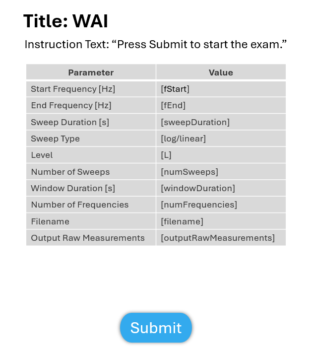
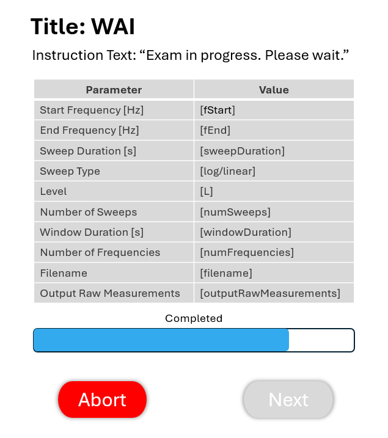

Wideband Acoustic Immittance
=================================

This test is to perform a WAI (Wideband Acoustic Immittance).

Revision Table
--------------

.. list-table::
   :widths: 12 18 10 60
   :header-rows: 1

   * - No
     - Date
     - Initials
     - Note
   * - 1
     - 14 November 2024
     - BGraybill
     - Initial commit for a WAI exam. 

References
----------

Related internal documents
^^^^^^^^^^^^^^^^^^^^^^^^^^

This software specification relates to the `firmware specification [link tbd] <>`_.

Algorithm
--------------

See `firmware specification [link tbd] <>`_.

Implementation
--------------

GUI
^^^^

The GUI should look like the image below with the following features.

* The following parameters should be configurable in the protocol: Start frequency of the sweep, end frequency of the sweep, frequency ratio, sweep duration, window duration, sweep type (log or linear), minimum number of sweeps, maximum number of sweeps, and the minimum noise floor threshold (i.e., the termination condition)
* The GUI should display the parameters from the protocol in a table similar to the one shown below
* There should be a `Submit` button to initiate the exam. The `Submit` button becomes inactive after initating the exam.
* After initiating the exam, a progress bar appears and the `Submit` button is replaced with an inactive `Next` button (See screen 2 image below).
* The `Next` button becomes active after the Swept OAE exam concludes.

.. list-table::
   :widths: 50, 50
   :header-rows: 1

   * - Parameter
     - Value
   * - Start Frequency [Hz]
     - [start_F]
   * - End Frequency [Hz]
     - [end_F]
   * - Sweep Duration [s]
     - [SweepDuration]
   * - Window Duration [s] 
     - [WindowDuration]
   * - Sweep type
     - [SweepType]
   * - Minimum Number of Sweeps
     - [MinSweeps]
   * - Maximum Number of Sweeps
     - [MaxSweeps]
   * - Noise Floor Threshold
     - [MinDpNoiseFloorThresh]

   **Figure 1.** *GUI for the Swept OAE exam priot to submission. Screen 1a*

   **Figure 2.** *GUI for the swept OAE exam while the exam is in progress. Screen 1b*

Results-View
^^^^^^^^^^^^^

The GUI should display the results of the WAI exam:
* Results are plotted in a manner similar to the plot shown below.

   **Figure 3.** *GUI for the WAI Results screen. Results Screen*

Software Testing Procedures
---------------------------

Algorithm
^^^^^^^^^^^

.. list-table::
   :widths: 30, 30, 30, 6
   :header-rows: 1

   * - Requirement
     - Test Case
     - Acceptance
     - Verified
   * - The exam presents a chirp with a specified starting and ending frequency, output level, sweep duration, window duration, and sweep type.
     - Initiate a WAI exam using the Submit button.
     - Verify that the emitted chirp is the correct starting and ending frequency, output level, sweep duration, window duration, and sweep type.
     - 
   * - The exam presents a number of chirps greater than or equal to the Minimum Number of Sweeps and less than or equal to the Maximum Number of Sweeps.
     - Initiate a WAI exam using the Submit button. Intentionally prevent the exam from meeting the threshold criterion. This could be accomplished in many ways including, but not limited to, specifying a very few number of 
     - Verify that the exam plays at least the Minimum Number of Sweeps and no more than the Maximum Number of Sweeps, then concludes.
     - 
   * - If the noise threshold criterion is met, the exam concludes.
     - ???
     - Verify that exam concludes if the noise threshold criterion is met.
     - 
   * - The exam can be aborted.
     - Initiate an exam normally. Once the exam is active, click `Abort`.
     - Verify that the exam aborts successfully and proceeds to the results-view.
     - 
   * - The exam results are displayed.
     - Complete an exam normally. Then click the `Finish` button. Proceed to the results-view page.
     - Verify that the absorbance, power reflectance, impedance magnitude, and impedance phase are plotted as a function of frequency.
     - 

Data
^^^^^^^^^^^^^

.. list-table::
   :widths: 30, 30, 30, 6
   :header-rows: 1

   * - Requirement
     - Test Case
     - Acceptance
     - Verified
   * - The exam must return all fields defined in `firmware specification [link tbd] <>`_. 
     - Start a WAI exam and complete the exam successfully. 
     - Verify the exam returns all result fields defined in `firmware specification [link tbd] <>`_ with appropriate values.
     - 
   * - The exam must display all `WAIResults` fields defined  in `firmware specification [link tbd] <>`_.
     - Start a WAI exam, complete the exam. 
     - Verify that all results are accurately displayed.
     - 
   * - The exam must export all `WAIResults` fields defined in `firmware specification [link tbd] <>`_.
     - Submit the exam and export results.
     - Verify that all results are accurately exported.
     - 

GUI
^^^^

.. list-table::
   :widths: 30, 30, 30, 6
   :header-rows: 1

   * - Requirement
     - Test Case
     - Acceptance
     - Verified
   * - The user can initiate the exam specified in the protocol.
     - Load a WAI exam protocol. Then, click `Submit`.
     - Verify that the GUI displays the parameters in the exam protocol and that the exam is initiated after `Submit` is pressed.
     - 
   * - The user can abort the exam.
     - During an active exam, press `Abort`.
     - Verify that the exam aborted.
     -
   * - The user can submit results.
     - After a successful exam, press `Submit`.
     - Verify that the exam results were saved and/or exported to the repository, as specified in the protocol.
     - 
