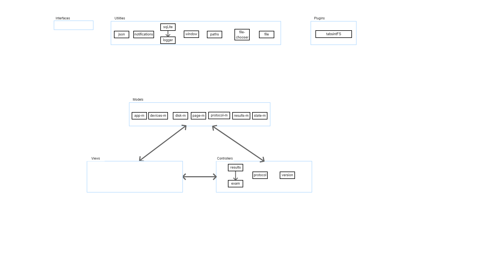

# App Architecture

The application is designed following a [Model-View-Controller (MVC) design pattern](https://developer.mozilla.org/en-US/docs/Glossary/MVC).

- [Interfaces](https://www.typescriptlang.org/docs/handbook/interfaces.html) are used to define data structures, limiting the use of the `any` type. 
- `Utilities` are functions and classes that don't depend on models and services, such that they can be called from anywhere. Utilities are [services](https://angular.dev/guide/di/creating-injectable-service) in the Angular terminology, which are injectable accross the application. Models define the data structure and save the data associated with each model. 
- `Models` and `Controllers` are [services](https://angular.dev/guide/di/creating-injectable-service) in the Angular terminology. 
- `Views` are [components](https://angular.dev/guide/components) in the angular terminology, and encompass:
  * a TypeScript class with behaviors, 
  * a HTML template that renders as the UI, 
  * a CSS file that defines the component styles, and 
  * a test file. 

- `Response Areas` are how TabSINT runs and displays exam realted content. They consist of `Views`, use `Models`, and `Controllers`. `Response Areas` live in src/app/views/response-area/response-areas/ and have the following file structure (replace myResponseArea with the name of your response area):
  * myResponseArea
    * HTML file
    * Typescript file
    * CSS file
    * test file
  * myResponseAreaViewer
    * HTML file
    * Typescript file
    * CSS file
    * test file
  * interface file that describes parameters required for the response area

Separating the component's view-related features from services other kinds of processing makes the component classes lean and efficient. The specifics of how the models, views, controllers, and utilities related to each other in TabSINT are illustrated here. It is important to carefully follow the dependency injections to avoid circular injections.

[PREVIOUS: Building and Running](building-running.md)

[NEXT: Repository Organization](organization.md)

[BACK TO INDEX](developer-guide-index.md)